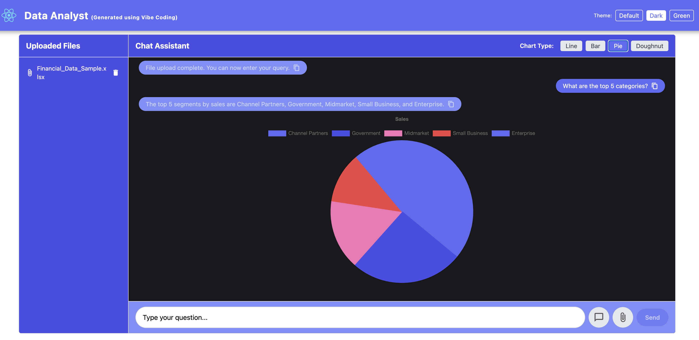

# Vibe Coding Example: Financial Data Q&A App

## Overview
This project is a fullstack application for uploading Excel files with multiple tabs and querying financial data using natural language. It features:
- **Frontend:** Expo React Native (TypeScript, NativeWind/Tailwind, react-native-chart-kit)
- **Backend:** Nest.js (TypeScript, LangChain with Google Gemini, xlsx for Excel parsing)

## Usage
1. Get the Google Gemini API Key from: https://aistudio.google.com/app/apikey
2. Rename the `/backend/.env.example` to `.env` and update the env variable `GOOGLE_API_KEY` with the Gemini API Key from step #1
3. Run `npm install` from the main project folder (`vibe-coding`)
4. Start the backend server (`npm run backend`). Run this command from the main project folder (`vibe-coding`)
5. Start the frontend app (`npm run frontend`). Run this command from the main project folder (`vibe-coding`)
6. Upload an Excel file (you can use a sample from `sample-data` folder), enter your query, and view the summary and chart.

## Example queries
- Show top five products sold in Canada
- Shopw top five contries by sales revenue

## Features
- Upload Excel files with multiple sheets
- Ask questions about the data in natural language
- Get a text summary and a chart visualization

## Tech Stack
- **Frontend:** Expo, React Native, NativeWind, react-native-chart-kit
- **Backend:** Nest.js, LangChain, Google Gemini, xlsx, multer

## Screenshots
Below screenshots are examples that shows the chat feature, dynamic graph and theme switching

---
